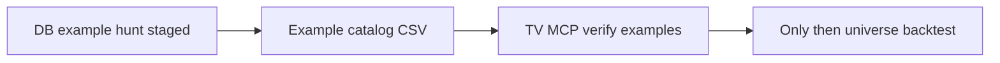

# Weekly BigVol + TTM Squeeze — next steps plan

Date: 2026-08-21

Overview: Before live signals or full edge backtests, find concrete historical examples of Weekly BigVol + TTM Squeeze setups in TimescaleDB, verify a handful on TradingView, then only proceed to universe scoring if examples look real.

## Checklist

- [x] Add TimescaleDB example-hunter script (pandas, not Backtrader): load daily, resample weekly, emit ignition + full-setup event CSVs
- [x] Run staged hunt on liquid subset then broader universe; produce example catalog (symbol, ignition week, confirm week, condition flags)
- [x] TradingView MCP: verify ~8-12 catalog examples on 1W charts (volume bar, TTM zero-cross, 10/30 MA) — see [phase1 report](2026-08-21_weekly_bigvol_phase1_tv_verify.md)
- [x] Sample weekly completeness on symbols that produced examples; note incomplete-week false positives
- [x] Phase 2 smoke: 300-symbol setup expectancy + IB 15m 20-symbol BT — see [phase2 report](2026-08-22_weekly_bigvol_phase2_edge_smoke.md)
- [ ] Expand: full daily hunt + larger IB 15m BT; then keep / fix-data / kill
- [ ] Only then robustness grid + walk-forward

## Shift from prior plan

Do **not** start with live signal scanning or a full universe backtest. First answer: **do clear historical examples of this setup exist in our TimescaleDB data?** If yes and TradingView agrees, then score the edge.

## Context

- Strategy rules: [WEEKLY_BIGVOL_TTM_SQUEEZE_README.md](../strategies/WEEKLY_BIGVOL_TTM_SQUEEZE_README.md); logic in `strategies/weekly_bigvol_components.py` (`is_ignition_bar`, TTM confirmation, trend filter).
- DB: ~2,203 ALPACA daily symbols, 2017-11-29 → 2025-11-26; **no weekly bars** — resample from daily ([stock market data status](../2026-08-21_stock_market_data.md)).
- Existing squeeze scanner = TTM zero-cross only; **not** full strategy examples.
- Incomplete weekly bars can invent false TTM crosses vs TradingView.

## Approach: staged examples in data

### Phase 0 — Example hunter (TimescaleDB / pandas)

Add a focused script under `scripts/data/` (e.g. `find_weekly_bigvol_examples.py`) that:

1. Loads daily OHLCV via `utils.db.timescaledb_client` / existing loaders (same path as `utils.scanning.squeeze.load_from_timescaledb`).
2. Resamples to weekly (W-FRI), matching strategy/scanner convention.
3. Reuses the same numeric definitions as the strategy where practical:
   - **Condition A (ignition):** multi-threshold volume + body position + MA filter (mirror `VolumeAnalytics.is_ignition_bar` / README defaults).
   - **Condition B (TTM):** LazyBear momentum zero-cross + squeeze-lookback heuristic (reuse `indicators.ttm_squeeze.calculate_squeeze_momentum` / `utils.scanning.squeeze`).
   - **Condition C (trend):** close vs rising 30w MA, not too extended; confirm within `max_delay_weeks` of ignition.
4. Writes two CSVs:
   - `reports/examples/weekly_bigvol_ignitions_{ts}.csv` — Condition A events (more plentiful, easy to eyeball).
   - `reports/examples/weekly_bigvol_full_setups_{ts}.csv` — A+B+C linked events (true strategy examples).

Columns: `symbol`, `ignition_week`, `confirm_week`, `vol`, `body_pos`, `mom_prev`, `mom`, `ma30`, flags, optional forward 4w/13w return for curiosity only (not edge proof).

**Default hunt order (staged):**

1. Liquid subset (~30–50 names: mega-caps + high-volume ETFs/stocks in universe) — fast catalog + TV checks.
2. If too few full setups: expand to 300 / full daily universe.

Date window: **2018-01-01 → 2025-11-26**.

### Phase 1 — Review the catalog (human + TV)

Goal is qualitative: “I recognize these as the webinar-style setups.”

- Prefer **full setups** for TV; use **ignition-only** when learning what Condition A looks like on the chart.
- TradingView MCP on **1W**: jump to `ignition_week` / `confirm_week`, confirm huge volume bar, TTM zero-cross, 10/30 MA context (`chart_set_symbol`, `chart_set_timeframe`, `chart_scroll_to_date`, screenshot).
- Drop / tag examples that only appear because of incomplete weeks.

**Exit criteria for Phase 1:** at least a handful of TV-confirmed full setups (target ~5–10), or a clear finding that full setups are vanishingly rare / mostly data artifacts.

### Phase 2 — Only then: edge validation (deferred)

Unchanged from before, but gated on Phase 1:

- Universe backtest → PF / expectancy / trade count / DD ([assessing_strategies.md](../assessing_strategies.md)).
- Robustness + walk-forward only if metrics clear gates.

## Tool roles

| Tool | Role now |
|------|----------|
| **TimescaleDB** | Find and list historical examples at scale |
| **TradingView MCP** | Confirm examples look like the intended weekly setup |
| **Backtrader universe run** | Later — measure edge, not discover examples |

## What not to do yet

- No live “what’s firing now” scan as the first step.
- No full-universe performance judgment before examples are verified.
- No parameter optimization.

## Success / kill for the example phase

- **Continue to backtest:** several clean full setups match TV on 1W.
- **Fix data first:** many DB examples fail TV (incomplete weeks).
- **Revisit rules:** almost no full setups even on large universe, or ignitions never get TTM/trend confirmation within `max_delay_weeks`.
